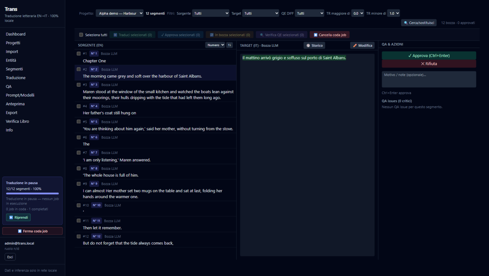
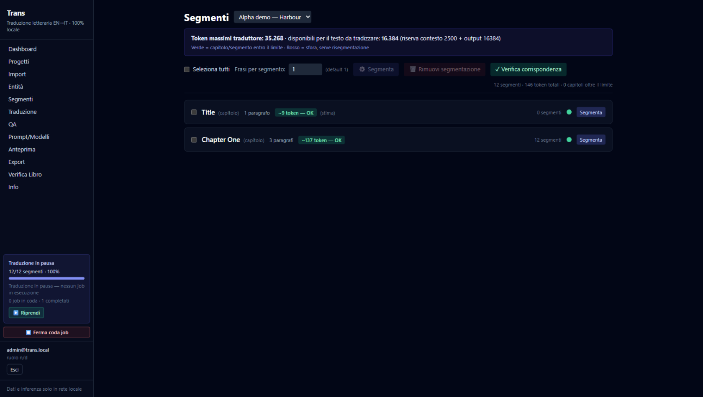

# Trans — local literary translation platform (EN → IT)

Trans is a **local-first, LLM-assisted CAT (Computer-Assisted Translation)
workbench for literary texts**: upload an English novel or essay, let the
platform structure it into chapters and segments, build a controlled
glossary and a translation memory, translate block-by-block with your own
local LLMs, then review, verify and approve every segment — and export the
result as DOCX, EPUB, PDF/HTML or bilingual CAT files (XLIFF / TMX / CSV).

Everything runs **on your machine**: no cloud services, no telemetry, no
data leaves your network. Inference goes exclusively through an
OpenAI-compatible **LLM Gateway** you control (llama.cpp, llama-swap, vLLM,
LM Studio, ...).

> **Status: alpha (`v0.1.0-alpha`)**. The platform is in daily use for real
> EN→IT literary work and is feature-complete for the single-user workflow,
> but APIs, the DB schema and the UI will still change. The web UI is
> currently in **Italian** (the tool targets Italian literary translators);
> an English UI is planned. Code comments are a mix of English and Italian.

| The CAT workbench — translate, review, approve | Token-budgeted segmentation |
|---|---|
|  |  |

## Highlights

- **PDF import** of digital books and scans: layout-aware extraction,
  OCR fallback, repeated header/footer removal (PRD §5.2, ADR-002).
- **Structure detection**: chapters from bookmarks/heading patterns, an
  editor to fix boundaries, segment re-generation that preserves approved
  work.
- **Literary knowledge base**: characters, places, artifacts, invented
  species/organizations with aliases, grammatical gender, number and
  per-entity translation decisions; entity extraction via BookNLP (vendored,
  local GPU service) and/or a structured-JSON LLM pass (PRD §6).
- **Glossary-constrained translation** with translation memory and
  retrieval, 16k-token blocks, style profiles per genre, translate-then-
  refine prompting, anti-copy and anti-English validators with a fallback
  model (PRD §9–10).
- **Human-in-the-loop approvals**: LLM output is always `machine_draft`;
  approved versions are immutable and every edit creates a new version,
  with a full audit trail (PRD §5.8).
- **Quality estimation**: segment-level scores (is it Italian? is it
  translated? is it still English?) from a small local QE model, with
  filters and highlighting in the review UI (PRD §10.2-bis).
- **Editorial exports**: DOCX, EPUB (incl. "clone" exports that mimic the
  source typography), PDF, HTML preview, plus XLIFF/TMX/CSV for round-trips
  with professional CAT tools (PRD §15.4).
- **Privacy by construction**: a `local_only` policy rejects any outbound
  URL that is not local; manuscript text is never written to logs
  (JSON-sanitized logging); at-rest storage encryption and signed URLs in
  the prod profile (PRD §13).

## Architecture at a glance

```
            browser (Next.js UI, Italian)
                    │  same-origin /api/v1/* (no CORS)
                    ▼
        ┌───────────────────────┐     /api/gateway/* proxy
        │  frontend  (Next.js)  │──────────────┐
        └──────────┬────────────┘              │
                   │ /api/v1/* rewrite         ▼
        ┌───────────────────────┐        LLM Gateway (yours)
        │  backend   (FastAPI)  │        OpenAI-compatible,
        │  + in-process jobs    │        local only (:8080 by default)
        └───┬──────┬──────┬─────┘             │
            │      │      │            ┌──────┴──────┐
            ▼      ▼      ▼            │  optional   │
      PostgreSQL  Redis  MinIO         │ QE service  │
        +pgvector  jobs  objects       │ (small LLM) │
        (schema via Alembic)           └─────────────┘
```

- `frontend/` — Next.js + TypeScript + Tailwind (host port **3002** → 3000)
- `backend/` — FastAPI + SQLAlchemy + Alembic + pgvector (port 8000)
- `worker/` — Celery worker (the operational scheduler is in-process, ADR-007)
- `infra/` — docker-compose files (dev + hardened prod profile with TLS)
- `backend/migrations/` — the DB schema, managed **only** by Alembic
- `deploy/qe-service/` — optional standalone quality-estimation bridge
- `docs/` — PRD, architecture notes and ADRs
- `vendor/booknlp-src/` — vendored BookNLP used by the literary NLP service

## Quick start

Requirements: Docker Engine 24+ with Compose v2, and a local
OpenAI-compatible LLM endpoint for inference.

```bash
# 1. configure (gateway URL, models, admin password)
cp .env.example .env
$EDITOR .env

# 2. bring the stack up
just up            # or: docker compose -f infra/docker-compose.yml up -d
```

Then:

- App: <http://localhost:3002> — login `admin@trans.local` / `trans-admin`
  (dev defaults from `.env`; **change them**)
- API health: <http://localhost:8000/health>
- MinIO console: <http://localhost:9001> (`minioadmin` / `minioadmin`)
- DB shell: `just db-shell`

> The backend image installs the code (`pip install .`), and the frontend
> image bakes the production build: after changing code run
> `docker compose -f infra/docker-compose.yml build backend frontend && just up`.
> See `docs/DEPLOYMENT.md`.

## Connecting your models

1. Run any OpenAI-compatible server, e.g. llama.cpp:

   ```bash
   llama-server -m ./my-model.gguf --port 8080 --api-key sk-local-dev-change-me
   ```

2. Point the stack at it in `.env`:

   ```bash
   LLM_GATEWAY_BASE_URL=http://host.docker.internal:8080/v1
   LLM_GATEWAY_API_KEY=sk-local-dev-change-me
   TRANS_DEFAULT_TRANSLATION_MODEL=<model id from GET /v1/models>
   ```

The platform never hardcodes model names: it reads `GET /v1/models` from
the gateway, shows the capability matrix in the UI (Models page) and lets
you pick per project (translation model, text model, sampling settings).

**Quality estimation (optional)** scores each translated segment with a
small model. By default it is expected behind the same gateway at
`/upstream/qe`; you can also point `QE_BASE_URL` at any OpenAI-compatible
endpoint, or run the tiny bridge in `deploy/qe-service/` (see its README).

## Services & ports

| Service  | Container      | Host port(s)           | What it does                          |
|----------|----------------|------------------------|---------------------------------------|
| db       | trans-db       | 5432                   | PostgreSQL 16 + pgvector              |
| redis    | trans-redis    | 6379                   | broker/cache (jobs are in-process, ADR-007) |
| minio    | trans-minio    | 9000 / 9001            | S3-compatible object storage / console|
| backend  | trans-backend  | 8000                   | FastAPI (`/health`, `/health/db`)     |
| frontend | trans-frontend | **3002** → 3000        | Next.js app                           |

Host port 3002 maps to the container's 3000 so the stack can coexist with
anything else you run on 3000 — adjust in `infra/docker-compose.yml`.

## Configuration

Environment variables are read by the services from the compose file /
`.env` (full annotated list: [.env.example](.env.example)):

| Variable                      | Used by         | Default                                   |
|-------------------------------|-----------------|-------------------------------------------|
| `DATABASE_URL`                | backend, worker | `postgresql+psycopg2://trans:trans@db:5432/trans` |
| `REDIS_URL`                   | backend, worker | `redis://redis:6379/0`                    |
| `MINIO_ENDPOINT` / keys       | backend, worker | `minio:9000`, `minioadmin`/`minioadmin`   |
| `LLM_GATEWAY_BASE_URL`        | backend         | `http://host.docker.internal:8080/v1`     |
| `LLM_GATEWAY_API_KEY`         | backend         | `sk-local-dev-change-me`                  |
| `QE_BASE_URL` / `QE_MODEL`    | backend         | derived from gateway / `qe-verify`        |
| `TRANS_DEFAULT_TRANSLATION_MODEL` | backend     | `translategemma-27b-it`                   |
| `TRANS_FALLBACK_TRANSLATION_MODEL` | backend    | *(empty — disabled)*                      |
| `SEED_ADMIN_EMAIL` / `_PASSWORD` | backend       | `admin@trans.local` / `trans-admin` (dev) |
| `AUTH_DISABLED`               | backend         | `0` (authentication on)                   |
| `JWT_SECRET`                  | backend         | `dev-insecure-change-me` (**change it**)  |
| `LOG_LEVEL`                   | all             | `info`                                    |

The prod profile (`docker-compose.prod.yml`) additionally requires
`POSTGRES_PASSWORD`, `REDIS_PASSWORD`, `MINIO_ACCESS_KEY`/`MINIO_SECRET_KEY`,
a real `JWT_SECRET` and mounts storage/backup keys from `infra/secrets/`
(never committed). It publishes only a single TLS entrypoint (nginx, port
443) and keeps db/redis/minio off the host.

## Database schema & migrations

The schema is managed **only by Alembic** (`backend/migrations/`: pgvector
extension, append-only audit triggers included). The backend container runs
`alembic upgrade head` before uvicorn, so a fresh db volume boots from zero.
Apply manually with:

```bash
just migrate   # docker compose exec backend alembic upgrade head
```

## Tests

```bash
cd backend
../.venv-backend/bin/python -m pytest tests/ -q
```

The suite expects a local Postgres on :5432 (user `trans`/`trans`, like the
compose db); it creates dedicated databases (`trans_test`, `trans_hard`)
and applies Alembic from scratch on every run — it never touches your data
volume. More in `docs/TESTING.md`.

## Data & immutability

- All data lives in local Docker volumes (`db-data`, `redis-data`, `minio-data`).
- Approved versions are immutable: every edit produces a new version.
- LLM output stays `machine_draft` until a human approves it.
- Manuscript text never reaches the logs (sanitizer enforced, see PRD §13.2).

## Documentation

| Doc | Content |
|-----|---------|
| [docs/ARCHITECTURE.md](docs/ARCHITECTURE.md) | How the platform works: services, data model, pipelines, module map |
| [docs/DEPLOYMENT.md](docs/DEPLOYMENT.md) | Docker images, rebuild & recovery procedures, troubleshooting |
| [docs/PRD.md](docs/PRD.md) | Product requirements document (the spec this repo implements) |
| [docs/adr/](docs/adr/README.md) | Architecture decision records (gateway, parser pipeline, DB schema, job scheduler, BookNLP service) |
| [docs/benchmarks/](docs/benchmarks/README.md) | Synthetic benchmark corpus + parser/OCR/NER benchmark harnesses |
| [docs/TESTING.md](docs/TESTING.md) | Test suites, conventions, how to run them |
| [CONTRIBUTING.md](CONTRIBUTING.md) | Development conventions and ground rules |
| [NOTICE.md](NOTICE.md) | Third-party components (BookNLP, DejaVu fonts) |

## Security notes

- Default credentials (`trans`/`trans`, `minioadmin`/`minioadmin`, the dev
  seed admin) are for local development only; the prod profile requires
  explicit secrets.
- `LOCAL_ONLY=1` (default) makes the backend refuse to call any endpoint
  outside the machine/compose network.
- No service writes manuscript data to logs; log records are JSON-sanitized.

## Local-only guarantee

There is **no** cloud dependency in this repo. Every image is a standard
public image; every endpoint the platform can call is localhost or an
internal compose network name, and the `local_only` policy enforces it at
runtime.

## License

MIT — see [LICENSE](LICENSE). Bundled third-party components are listed in
[NOTICE.md](NOTICE.md).
